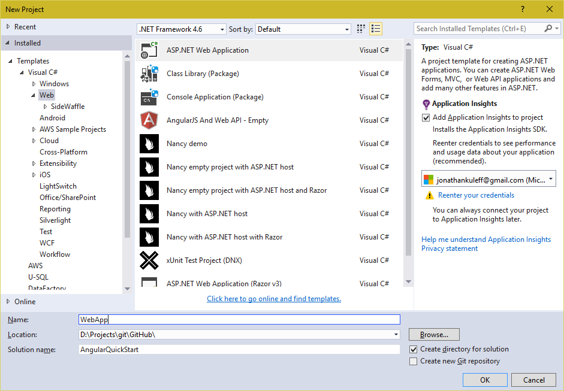

# Angular 2 (rc1) 5 Minute QuickStart using Angular Cli with ASP.NET 5 in Visual Studio 2015

This repository aims to setup the [Angular 2 5 Min QuickStart Guide](https://angular.io/docs/ts/latest/quickstart.html)
using the [Angular Cli](https://github.com/angular/angular-cli) and [ASP.NET 5](https://docs.asp.net/en/latest/) in Visual Studio 2015.

> If your looking for a QuickStart implementation without Angular Cli checkout [Angular 2 5 Min Quick Start with ASP.NET Core in Visual Studio 2015](https://github.com/JonCubed/angular2-quick-start-aspnet-core-vs2015)

## Perequisite

I'm using:

    * Visual Studio 2015 Community Update 2
    * [ASP.NET and Web Tools 2015 (RC1 Update 1)](https://docs.asp.net/en/latest/getting-started/installing-on-windows.html#install-asp-net-5-with-visual-studio)
    * [ASP.NET 5 Scripts Task Runner](https://visualstudiogallery.msdn.microsoft.com/9397a2da-c93a-419c-8408-4e9af30d4e36)
    * Typescript 1.8.30.0
    * Typings 0.8.1
    * NPM 3.8.8
    * Angular Cli 0.0.39

Visual Studio 2015 includes its own version of external tools, unfortunately these tools have not been updated causing errors with some required packages.
To fix this we are going to force Visual Studio to use our global installs of node and npm.
Follow the instructions in the follow blog - [Customize external web tools in visual studio 2015](https://blogs.msdn.microsoft.com/webdev/2015/03/19/customize-external-web-tools-in-visual-studio-2015/).

### Setting up ASP.NET Core RC1

1. Follow instructions to [Install ASP.NET 5 on Windows](https://docs.asp.net/en/1.0.0-rc1/getting-started/installing-on-windows.html)

1. Upgrade to latest framework, in command prompt

    ```powershell
    > dnvm upgrade latest -r clr -arch x64
    ```

## 5 Min QuickStart

Have a look at the [5 Min QuickStart Guide](https://angular.io/docs/ts/latest/quickstart.html) before continuing to have a better understanding of we are doing here.

### Step 1. Create an empty ASP.NET Core project

1. Open Visual Studio 2015 and click *New Project...* on Start Page.

1. Create a new ***ASP.NET Web Application***
    

1. Select ***Empty*** from *ASP.NET 5 Templates*
    

### Step 2. Setup Angular 2 in the project

1. Open an elevated command prompt at the project folder, i.e. {solution}/src/{project}

1. Run the following command

    ```cmd
    > ng init --name my
    ```
1. ASP.NET Core expects our static files to be placed in ***wwwroot/*** however by default the Angulare Cli will output to *dist/*.
  To fix this add a new ***JSON File*** to the project's root folder called ***.ember-cli*** and copy/paste the following:

    ```json
    {
        "output-path": "wwwroot/"
    }
    ```
> In future versions this will probably be move into angular-cli.json

### Step 3. Configure Typescript

1. Copy/paste the following into *tsconfig.json* in *src/*

    ```json
    {
        "compileOnSave": true,
        "compilerOptions": {
            "declaration": false,
            "emitDecoratorMetadata": true,
            "experimentalDecorators": true,
            "mapRoot": "",
            "module": "commonjs",
            "moduleResolution": "node",
            "noEmitOnError": true,
            "noImplicitAny": false,
            "outDir": "../wwwroot/",
            "rootDir": ".",
            "sourceMap": true,
            "target": "es5",
            "inlineSources": true
        },
        "files": [
            "main.ts",
            "typings.d.ts"
        ]
    }
    ```

### Step 4. Configure ASP.NET Core

#### Add support in ASP.NET 5 for static files

1. Update ***project.json*** in the root folder, copy/paste the following:

        ```json
        {
            "version": "1.0.0-*",
            "compilationOptions": {
                "emitEntryPoint": true
            },

            "dependencies": {
                "Microsoft.AspNet.IISPlatformHandler": "1.0.0-rc1-final",
                "Microsoft.AspNet.Server.Kestrel": "1.0.0-rc1-final",
                "Microsoft.AspNet.StaticFiles": "1.0.0-rc1-final"
            },

            "commands": {
                "web": "Microsoft.AspNet.Server.Kestrel"
            },

            "scripts": { "postbuild": [ "powershell -Command \"$env:project:Directory=Get-Location;Start-Process powershell -Verb runAs -ArgumentList \\\"-Command `\\\"Set-Location $env:project:Directory;ng build`\\\"\\\" " ] },

            "frameworks": {
                "dnx46": { },
                "dnxcore50": { }
            },

            "exclude": [
                "wwwroot",
                "node_modules"
            ],
            "publishExclude": [
                "**.user",
                "**.vspscc"
            ]
        }
        ```
> Note: We also added a post build scipt for running Angular Cli build command, which we will integrate soon

1. Update ***Configure()*** in *Startup.cs* in the root folder

        ```csharp
        public void Configure(IApplicationBuilder app)
        {
            app.UseIISPlatformHandler();
            app.UseDefaultFiles();
            app.UseStaticFiles();
        }
        ```

1. Delete ***tsconfig.json*** from ***wwwroot/***

#### Integrate Angular Cli with MSBuild

1. Open the ***Task Runner Explorer***, you should see the following:

    

1. Right Click ***ng build*** and bind to ***After Build***

> Task Runner Seems to be a little buggy at the moment so you might need to run this manually
from Task Runner Explorer or in the command prompt using *ng build*

### Step 5. Our first Angular Component

1. Update ***my.component.ts*** in the *app* folder and paste the following lines:

    ```typescript
    import { Component } from '@angular/core';

    @Component({
    moduleId: module.id,
    selector: 'my-app',
    templateUrl: 'my.component.html',
    styleUrls: ['my.component.css']
    })
    export class WebAppAppComponent {
        title = 'My First Angular 2 App';
    }
    ```

> Due to Angular Cli enforcing Style Guide recommendations this component is named differently than 5 Min QuickStart, but functionality is same

### Step 6. Build and run

1. Press ***F5*** in Visual Studio, a browser tab should open with *My First Angular 2 App* displayed

## Taking advantage of ASP.NET

So far we have a pretty static solution and are not taking advantage of ASP.NET 5 so lets make some changes.

### Step 1. Add Mvc

1. Update ***dependencies*** property in *project.json*, copy/paste the following:

    ```json
    "dependencies": {
        "Microsoft.AspNet.IISPlatformHandler": "1.0.0-rc1-final",
        "Microsoft.AspNet.Server.Kestrel": "1.0.0-rc1-final",
        "Microsoft.AspNet.StaticFiles": "1.0.0-rc1-final",
        "Microsoft.AspNet.Mvc": "6.0.0-rc1-final",
        "Microsoft.Extensions.Configuration.FileProviderExtensions": "1.0.0-rc1-final",
        "Microsoft.Extensions.Configuration.Json": "1.0.0-rc1-final",
        "Microsoft.Extensions.Logging": "1.0.0-rc1-final",
        "Microsoft.Extensions.Logging.Console": "1.0.0-rc1-final",
        "Microsoft.Extensions.Logging.Debug": "1.0.0-rc1-final",
        "Microsoft.AspNet.Mvc.TagHelpers": "6.0.0-rc1-final",
        "Microsoft.AspNet.Tooling.Razor": "1.0.0-rc1-final",
        "Microsoft.Extensions.CodeGenerators.Mvc": "1.0.0-rc1-final"
    }
    ```

1. Add a ***Controllers*** folder in the root project folder

1. Add a ***MVC Controller Class*** called ***HomeController*** in *controllers* folder

1. Add a ***Views*** folder in the root project folder

1. Add a ***MVC View Start Page*** called ***_ViewStart.cshtml*** in *views* folder

1. Add a ***MVC View Imports Page*** called ***_ViewImports.cshtml*** in *views* folder

1. Update ***Views/_ViewImports.cshtml***, copy/paste the following:

    ```razor
    @using WebApp
    @addTagHelper "*, Microsoft.AspNet.Mvc.TagHelpers"
    ```

1. Add a ***Shared*** folder to the *views* folder

1. Add a ***MVC View Layout Page*** called ***_Layout.cshtml*** to *views/shared* folder

1. Add a ***Home*** folder to the *views* folder

1. Add a ***MVC View Page*** called ***Index.cshtml*** to the *views/home* folder

1. Add a ***ASP.NET Configuration File*** called ***appsettings.json*** to the *config* folder

1. Replace ***appsettings.json***, copy/paste the following:

    ```json
    {
        "Logging": {
            "IncludeScopes": false,
            "LogLevel": {
                "Default": "Verbose",
                "System": "Information",
                "Microsoft": "Information"
            }
        }
    }
    ```

1. Replace ***Startup.cs***, copy/paste the following:

    ```csharp
    using Microsoft.AspNet.Builder;
    using Microsoft.AspNet.Hosting;
    using Microsoft.Extensions.Configuration;
    using Microsoft.Extensions.DependencyInjection;
    using Microsoft.Extensions.Logging;

    namespace WebApp
    {
        public class Startup
        {
            public Startup( IHostingEnvironment env )
            {
                // Set up configuration sources.
                var builder = new ConfigurationBuilder()
                    .AddJsonFile("config/appsettings.json")
                    .AddJsonFile($"config/appsettings.{env.EnvironmentName}.json", optional: true);

                builder.AddEnvironmentVariables();
                Configuration = builder.Build()
                                    .ReloadOnChanged("config/appsettings.json")
                                    .ReloadOnChanged($"config/appsettings.{env.EnvironmentName}.json");
            }

            public IConfigurationRoot Configuration { get; set; }

            // This method gets called by the runtime. Use this method to add services to the container.
            // For more information on how to configure your application, visit http://go.microsoft.com/fwlink/?LinkID=398940
            public void ConfigureServices(IServiceCollection services)
            {
                services.AddMvc();
            }

            // This method gets called by the runtime. Use this method to configure the HTTP request pipeline.
            public void Configure(IApplicationBuilder app, IHostingEnvironment env, ILoggerFactory loggerFactory )
            {
                loggerFactory.AddConsole(Configuration.GetSection("Logging"));
                loggerFactory.AddDebug();

                app.UseIISPlatformHandler();

                app.UseStaticFiles();

                app.UseMvc(routes =>
                {
                    routes.MapRoute("default",
                                    "{controller=Home}/{action=Index}/{id?}");

                    routes.MapRoute("spa-fallback",
                                    "{*anything}",
                                    new { controller = "Home", action = "Index" });
                });
            }

            // Entry point for the application.
            public static void Main(string[] args) => WebApplication.Run<Startup>(args);
        }
    }
    ```

### Step 2. Move to Dynamic View

1. Replace ***_Layout.cshtml*** in *Views/Shared* folder. Copy/paste the following:

    ```razor
    <!doctype html>
    <html>
        <head>
            <meta charset="utf-8">
            <title>@ViewBag.Title</title>
            <base href="@ViewBag.BaseUrl">

            <link rel="icon" type="image/x-icon" href="favicon.ico">
            <meta name="viewport" content="width=device-width, initial-scale=1">

            @RenderSection("Styles", required: false)

            <!-- Service worker support is disabled by default.
                Install the worker script and uncomment to enable.
                Only enable service workers in production.
            <script type="text/javascript">
            if ('serviceWorker' in navigator) {
                navigator.serviceWorker.register('/worker.js').catch(function(err) {
                console.log('Error installing service worker: ', err);
                });
            }
            </script>
            -->
        </head>
        <body>
            @RenderBody()

            @RenderSection("BodyScripts", required: false)
        </body>
    </html>
    ```

1. Replace ***Index.cshtml*** in *Views/Home* folder. Copy/paste the following:

    ```razor
    @{
        ViewBag.Title = "Angular 2 QuickStart";
        ViewBag.BaseUrl = "/";
    }

    @section Styles {
        <link rel="stylesheet" href="libs/css/styles.css">
    }

    @section BodyScripts
    {
        <script src="vendor/es6-shim/es6-shim.js"></script>
        <script src="vendor/reflect-metadata/Reflect.js"></script>
        <script src="vendor/systemjs/dist/system-polyfills.js"></script>
        <script src="vendor/systemjs/dist/system.src.js"></script>
        <script src="vendor/zone.js/dist/zone.js"></script>

        <script>
            System.import('system-config.js').then(function () {
                System.import('main');
            }).catch(console.error.bind(console));
        </script>
    }

    <cache vary-by="@Context.Request.Path">
        <my-app>Loading...</my-app>
    </cache>
    ```
1. Delete ***Index.html*** in *wwwroot*

## Resources

The following resources were used to fill in the blanks

* [Angular 2 - 5 Min QuickStart](https://angular.io/docs/ts/latest/quickstart.html)

* [Starting Angular 2 in ASP.NET 5 with TypeScript using Visual Studio 2015](http://www.mithunvp.com/angular-2-in-asp-net-5-typescript-visual-studio-2015/)

* [TypeScript Handbook - ASP.NET Core Tutorial](https://github.com/Microsoft/TypeScript-Handbook/blob/master/pages/tutorials/ASP.NET%20Core.md)

Build failed.
The Broccoli Plugin: [BroccoliTypeScriptCompiler] failed with:
Error: ENOENT: no such file or directory, open 'D:\git\angular2-cli-quick-start-aspnet-core-vs2015\src\WebApp\tmp\broccoli_type_script_compiler-input_base_path-piSwN6Vb.tmp\0\src\tsconfig.json'